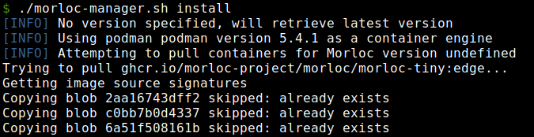

# Morloc Manager

Handle Morloc installation, version management, and custom environments.

 


## Prerequisites

You need a container engine: [Docker](https://docs.docker.com/engine/install/) (v20+) or [Podman](https://podman.io/docs/installation) (v3+). No Compose plugin is required.

The manager auto-detects whichever is available. You can override the choice with `--container-engine` or the `MORLOC_CONTAINER_ENGINE` environment variable.


## Installation

Download the manager and place it on your PATH:

```sh
BRANCH=dev
curl -o morloc-manager https://raw.githubusercontent.com/morloc-project/morloc-manager/refs/heads/${BRANCH}/morloc-manager.sh
chmod +x morloc-manager

# if using local containers:
mkdir -p ~/.local/bin
mv morloc-manager ~/.local/bin/

# if using system containers:
sudo mv morloc-manager /usr/bin
```

If necessary, update the path:

```sh
PATH="~/.local/bin:$PATH"
```

Then install Morloc:

```sh
morloc-manager install          # latest version
morloc-manager install 0.58.3   # specific version
```

This pulls the container images and sets up the local configuration.


## Usage

`morloc-manager run` executes commands within the morloc container.

### Compile and run a program

Given the morloc program:

```morloc
module foo (double)

import root-py

double :: Int -> Int
double x = 2 * x
```

You can install the required module with

```sh
morloc-manager run -- morloc install root-py
morloc-manager run -- morloc make foo.loc
morloc-manager run -- ./foo -h              # view usage statement
morloc-manager run -- ./foo 21              # output: 42
```

### Interactive shell

Drop into a container shell with the full Morloc toolchain. Including language
support for Python, R, C++ as well niceties like vim

```sh
morloc-manager run --shell
```

### Compiler development

The dev container includes Haskell tools for building the compiler from source.
It is not pulled by default — install with `--dev` to enable it:

```sh
morloc-manager install --dev               # pull dev container image
morloc-manager run --dev -- stack build     # build the compiler
morloc-manager run --dev -- stack test      # run the test suite
morloc-manager run --dev --shell            # interactive dev shell
```

### Switching versions

You can install multiple versions side-by-side and switch between them.

```sh
morloc-manager install 0.67.0    # install a new version
morloc-manager select 0.67.0     # switch to it
morloc-manager select 0.58.3     # switch to old version
morloc-manager info              # view installed versions
```


## Custom environments

If your project needs additional system packages or language libraries, you can
create a custom environment that layers on top of the base Morloc image.

### Create a new environment

```sh
morloc-manager env --init ml
```

This creates a stub Dockerfile at `~/.local/share/morloc/deps/ml.Dockerfile`.
Edit it to add your dependencies:

```dockerfile
# Automatically generated section, DO NOT MODIFY
ARG CONTAINER_BASE
FROM ${CONTAINER_BASE}
LABEL morloc.environment="ml"
ENV MORLOC_ENV_NAME="ml"
# End of automatically generated section

# Add custom setup below this line
RUN pip install scikit-learn matplotlib pandas
```

### Activate the environment

```sh
morloc-manager env ml
```

This builds the custom image (if needed) and updates the active environment. All
subsequent `morloc-manager run` calls use the custom environment — no flag
changes required:

```sh
morloc-manager run -- morloc make -o pipeline pipeline.loc   # runs in the ml environment
```

### Reset to the base environment

```sh
morloc-manager env --reset
```

### List available environments

```sh
morloc-manager env --list
```

### Other options

```sh
morloc-manager env ml --dev            # apply to the dev container instead
morloc-manager env ml --usr            # apply to the user container (default)
```


## Advanced usage

### How it works

The manager uses directory-based structured config under `~/.config/morloc/`
(local scope) or `/etc/morloc/` (system scope). Key config entries include
`active_version`, `active_scope`, `active_env`, and `container_engine`.
Per-version config lives under `versions/<ver>/config` with `image`,
`dev_image`, and `host_dir`. Custom environments are stored under
`versions/<ver>/environments/`.

`morloc-manager run` invokes `docker run` / `podman run` directly (no Compose
required), bind-mounting the version data directory and your current working
directory into the container.

### Extra container flags

For changes that go beyond image selection — port mapping, GPU passthrough,
extra volumes — use the `-x` flag to pass additional arguments to the container
engine:

```sh
morloc-manager run -x "--gpus all" -- morloc make foo.loc
```

### Info and diagnostics

```sh
morloc-manager info
```

Shows installed versions, which one is selected, compose file locations,
container engine, and SELinux status.

### Uninstall

```sh
morloc-manager uninstall 0.58.3   # remove a specific version
morloc-manager uninstall --all    # remove everything
```

`uninstall --all` removes version data, compose files, and container images.
The override file (if any) is preserved with a warning. Scripts in
`~/.local/bin/` are not removed — the output tells you how to delete them.
