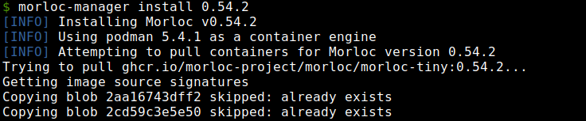

# Morloc Manager

Handle Morloc installation and removal

  

Setup morloc containers, scripts, and home for either the latest version of
Morloc or for the specified version.


## Installation

The only dependency is a container engine, currently two
[docker](https://docs.docker.com/engine/install/) and
[podman](https://podman.io/docs/installation) are supported.

You can retrieve the manager with curl:

```
curl -o morloc-manager https://raw.githubusercontent.com/morloc-project/morloc-manager/refs/heads/main/morloc-manager.sh
```

Then move it into your path (e.g., move it to ~/.local/bin) and make it
executable.

## Usage

Basic usage information is available for the main script and all subcommands: 

```
morloc-manager -h
morloc-manager install -h
morloc-manager uninstall -h
```

To install the latest version of Morloc, run `install` with no arguments:

```
morloc-manager install
```

This will retrieve required containers, create the morloc home directory, and
make four executable scripts:

 1. menv: runs commands in a Morloc container. Examples:

```
$ menv morloc make -o foo foo.loc
$ menv ./foo double 21
```

 2. morloc-shell: enter the "full" container in a shell
    - contains Python, R, and C++ compiler
    - contains vim and other conveniences

 3. menv-dev: runs commands in a dev container
    - contains Haskell tools for building from source
    - can access to all system executables

 4. morloc-shell-dev: enter the dev shell
